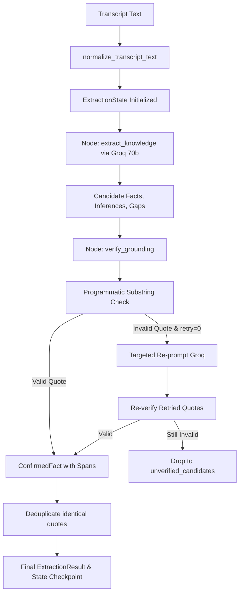

# Phase 2: Extraction & Grounding Engine - Research

**Researched:** 2026-09-09
**Domain:** LangGraph Knowledge Extraction, Groq LLM Structured Outputs, Verbatim Grounding Verification
**Confidence:** HIGH

<user_constraints>
## User Constraints (from CONTEXT.md)

### Locked Decisions
- **D-01 (Groq Model):** Primary model is `llama-3.3-70b-versatile` with automatic fallback to `llama-3.1-8b-instant` if 429 rate limits or transient errors occur.
- **D-02 (Temperature):** Generation temperature is `0.0` across all extraction tasks for strict deterministic generation.
- **D-03 (Testing Strategy):** Mock fixtures with canned structured outputs for hermetic unit tests; live Groq tests run only if `GROQ_API_KEY` is present.
- **D-04 (Timeouts & Retries):** 30s timeout with exponential backoff retry (up to 3 retries for 429/503 errors) before falling back to 8b.
- **D-05 (Quote Failure Handling):** Single targeted re-prompt for failed candidate quotes (`{claim, failed_quote, reason}`); drop if still unverified.
- **D-06 (Matching Target):** Match against `normalized_text` first; fallback to whitespace-collapsed match on `normalized_text`.
- **D-07 (Quote Length):** No length bounds — accept any verbatim substring regardless of length.
- **D-08 (Multi-Occurrence):** Record all occurrence span offsets as `[(start, end), ...]`.
- **D-09 (Speaker Labels):** Exclude speaker labels from quote text; store in dedicated `speaker` field.
- **D-10 (Contiguity):** Strictly forbid ellipsis (`...`) — quotes must be 100% contiguous literal substrings.
- **D-11 (Unverified Audit):** Retain rejected facts in graph state under `unverified_candidates: list[UnverifiedCandidate]` with reason.
- **D-12 (Deduplication):** Deduplicate identical source quotes, merging them into one `ConfirmedFact` with all occurrence spans.
- **D-13 (Casing Strategy):** Case-sensitive exact match first; fallback to case-insensitive match anchoring to transcript's actual casing.
- **D-14 (Sub-phrases):** Allow sub-phrases of compound sentences as long as they form an unbroken literal substring.
- **D-15 (Zero Facts Edge Case):** If 0 facts pass verification, complete cleanly and generate `UnknownGap` ("Transcript contained no verifiable project requirements").
- **D-16 (Category Enum):** Standardized Category Enum (`scope`, `timeline`, `budget`, `tech_stack`, `target_audience`, `constraints`, `integrations`, `other`).
- **D-17 (Inference Linkage):** `InferredPoint` links to supporting facts via `source_fact_ids: list[str]` + `rationale: str`.
- **D-18 (UnknownGap Schema):** Contains `impact_level: "high" | "medium" | "low"`, `missing_information: str`, and `suggested_question: str`.
- **D-19 (Frontend Coordinates):** `ConfirmedFact` formats coordinates as `spans: list[QuoteSpan]` with `start_char`, `end_char`, `line_start`, and `line_end`.
- **D-20 (Graph Topology):** Two-node pipeline: `extract_knowledge` -> `verify_grounding`.
- **D-21 (State Type):** `TypedDict` (`ExtractionState`) containing nested Pydantic models.
- **D-22 (Retry Flow):** Linear DAG — single targeted retry executes internally within `verify_grounding`.
- **D-23 (Persistence):** Compiled graph returns typed `ExtractionResult` and integrates with `SqliteSaver` using `settings.database_url` and `thread_id = transcript_id`.
- **D-24 (Prompt Structure):** Single unified extraction call with `with_structured_output(ExtractionResult)`.
- **D-25 (Token Limit):** Single-pass processing for transcripts up to 60k tokens (~45k words).
- **D-26 (Service Interface):** Service function `run_extraction_pipeline(transcript_id, transcript_text)` in `app/services/extraction.py`.

### the agent's Discretion
- Exact system prompt wording and instructions for distinguishing facts vs inferences vs unknowns.
- Specific helper utilities for calculating line numbers from character offsets.

### Deferred Ideas (OUT OF SCOPE)
- Contradiction detection (deferred to Phase 3 / EXTRACT-05).
- Follow-up question prioritization ranking (deferred to Phase 3 / CLARIFY-01).
- Human interrupt gates and UI clarify endpoint (deferred to Phase 4).
</user_constraints>

<architectural_responsibility_map>
## Architectural Responsibility Map

| Capability | Primary Tier | Secondary Tier | Rationale |
|------------|-------------|----------------|-----------|
| Domain Extraction Schemas | Backend Models (`app/models/extraction.py`) | API / Schemas | Strict Pydantic models defining epistemic types, categories, and spans |
| Groq LLM Client & Fallback | Backend Core / Services (`app/core/llm.py`) | LangChain | Wraps `langchain-groq` ChatGroq with temperature=0.0 and fallback model |
| LangGraph State Machine | Backend Graph (`app/graph/extraction.py`) | LangGraph Runtime | Two-node state graph orchestrating extraction and quote verification |
| Verbatim Quote Verification | Backend Verification (`app/services/grounding.py`) | Python string algorithms | Programmatic deterministic substring search, span calculation, and deduplication |
| Pipeline Orchestration Service | Backend Service (`app/services/extraction.py`) | FastAPI Dependency | Exposes clean functional entry point `run_extraction_pipeline()` |

</architectural_responsibility_map>

<research_summary>
## Summary

Phase 2 builds the core epistemic intelligence of NexBrief: transforming unstructured discovery transcripts into verifiable, grounded knowledge.

The architecture comprises three core elements:
1. **Epistemic Data Models:** `ConfirmedFact`, `InferredPoint`, `UnknownGap`, `UnverifiedCandidate`, and `ExtractionResult` structured via Pydantic v2. Each confirmed fact is anchored to client statements with character and line span coordinates. Inferences transparently reference the fact IDs they derive from.
2. **Groq Structured Output Client:** Leveraging `langchain-groq`'s `ChatGroq` with `with_structured_output(ExtractionResult)`. By default it targets `llama-3.3-70b-versatile` with an automatic fallback to `llama-3.1-8b-instant`.
3. **Deterministic Grounding Verifier & LangGraph Node:** A pure Python verification engine that inspects candidate facts against the transcript's normalized text. It enforces literal contiguous substrings, tolerates casing differences and subtle whitespace variances, computes all occurrence spans, triggers a single targeted re-prompt for failed quotes, and drops unverified claims into an audit trail.

**Primary recommendation:** Build domain schemas and the Groq client in Plan 02-01, then build the verification engine, LangGraph extraction state machine, and service layer with comprehensive tests in Plan 02-02.
</research_summary>

<standard_stack>
## Standard Stack

### Core
| Library | Version | Purpose | Why Standard |
|---------|---------|---------|--------------|
| `langgraph` | >=0.2.70 | State machine definition and durable checkpointing | Industry standard for cyclic/DAG LLM agent workflows |
| `langchain-groq` | >=0.2.5 | Ultra-low-latency Groq client integration | Native support for Groq tool calling and structured outputs |
| `langchain-core` | >=0.3.40 | Base message primitives and runnable interfaces | Foundational abstraction for LangGraph and LangChain |
| `pydantic` | >=2.10.0 | Structured output schemas and data validation | Native validation and JSON schema generation for Groq |
| `sqlmodel` | >=0.0.22 | Existing database integration | Interoperable with SQLite and Pydantic models |

### Supporting
| Library | Version | Purpose | When to Use |
|---------|---------|---------|-------------|
| `pytest` | >=8.3.0 | Unit and integration testing | Validating quote verification and mock graph execution |
| `pytest-asyncio` | >=0.24.0 | Async test support | Testing async service endpoints or graph invocations |

</standard_stack>

<architecture_patterns>
## Architecture Patterns

### Data Flow Diagram

### Verbatim Quote Substring Algorithm
1. **Primary Match:** Search for `source_quote` in `transcript_text` (`str.find` / `re.finditer(re.escape(quote))`).
2. **Case-Insensitive Match:** If not found, search with `re.IGNORECASE` and extract the matching slice directly from `transcript_text` to preserve authentic transcript casing.
3. **Whitespace Normalization Match:** If still not found, collapse multi-spaces and newlines into single spaces for both candidate quote and transcript text to detect matches with minor whitespace discrepancies, then map back to character spans.
4. **Coordinate Calculation:** For each match, compute:
   - `start_char`, `end_char`
   - `line_start`, `line_end` (by counting newline `\n` characters up to `start_char` and `end_char`).

</architecture_patterns>

<common_pitfalls>
## Common Pitfalls

### Pitfall 1: Hallucinated or Trimmed Quotes
**What goes wrong:** The LLM rewrites client quotes to be grammatical or omits stutters with ellipsis (`...`), causing literal substring searches to fail.
**How to avoid:** Explicit system prompt instructions forbidding ellipsis and emphasizing verbatim copying, coupled with the targeted re-prompt mechanism.

### Pitfall 2: Off-by-One Span Offsets in UI
**What goes wrong:** Character offsets calculated on normalized text differ from what the frontend renders if the frontend displays raw or re-formatted text.
**How to avoid:** Both backend verification and frontend viewer must operate on the exact `normalized_text` stored in the `transcript` record.

### Pitfall 3: Flaky Unit Tests Dependent on Live Groq API
**What goes wrong:** CI or test runs fail due to missing `GROQ_API_KEY` or rate limiting.
**How to avoid:** Unit tests mock `ChatGroq.with_structured_output` using standard unittest/pytest monkeypatch fixtures, returning deterministic Pydantic objects. Live integration tests run conditionally using `@pytest.mark.skipif(not os.getenv("GROQ_API_KEY"))`.

</common_pitfalls>

## Validation Architecture

### Test Framework
- **Framework:** `pytest` (>=8.3.0) with `pytest-asyncio`
- **Config:** `backend/pyproject.toml`
- **Quick run command:** `python -m pytest backend/tests/test_grounding.py`
- **Full suite command:** `python -m pytest backend/tests/`
- **Estimated runtime:** ~2-3 seconds for unit tests

### Test Modules for Phase 2
1. `backend/tests/test_schemas.py`: Validates Pydantic serialization, category validation, QuoteSpan models, and epistemic separation.
2. `backend/tests/test_grounding.py`: Unit tests for verbatim substring verification, case-insensitivity fallback, whitespace collapsing, multiple occurrences, and rejected quote tracking.
3. `backend/tests/test_extraction_graph.py`: Unit tests for LangGraph state machine execution using mocked Groq client, verifying state transitions and persistence.
4. `backend/tests/test_live_extraction.py`: Live integration test hitting Groq API with real transcript (skipped if `GROQ_API_KEY` is not set).

</metadata>
