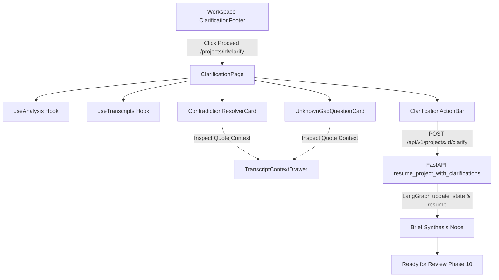

# Phase 9: Interactive Gap Clarification UI - Technical Research

**Date:** 2026-09-09
**Status:** Complete

---

## 1. Architecture & Data Flow



---

## 2. API Integration Patterns

### Backend Clarification Endpoint
- **Route:** `POST /api/v1/projects/{id}/clarify`
- **Request Body:**
  ```json
  {
    "clarifications": [
      {
        "question_id": "string",
        "resolved_text": "string",
        "resolved_by": "user"
      }
    ]
  }
  ```
- **Response:**
  ```json
  {
    "project_id": "string",
    "status": "ready_for_review",
    "draft_brief": { ... },
    "critique_report": { ... }
  }
  ```

### State Checkpoint Handshake
1. Before clarification, project status is `awaiting_clarification`.
2. Graph was paused at `interrupt_before=["synthesize_brief"]` during `POST /projects/{id}/analyze`.
3. Calling `/clarify` updates graph state with `{"user_clarifications": [...]}` as node `generate_clarifications` and invokes `graph.invoke(None, config)`.
4. Resumed nodes execute: `synthesize_brief` -> `critique_brief` -> `END`.
5. Status updates to `ready_for_review`, saving `ProjectBriefRecord` in SQLite database.

---

## 3. Frontend Architecture

### File Layout
- `frontend/src/lib/api/types.ts`: Add `UserClarification`, `ClarifyResponse`, `ClarifyRequest`.
- `frontend/src/lib/api/client.ts`: Add `apiClient.workflow.clarify(projectId, clarifications)`.
- `frontend/src/lib/utils/transcript-context.ts`: Helper to find surrounding context lines (5 lines before/after target quote).
- `frontend/src/components/clarification/TranscriptContextDrawer.tsx`: Accessible side drawer showing highlighted quote in surrounding conversation lines.
- `frontend/src/components/clarification/ContradictionResolverCard.tsx`: Interactive cards for Claim A / Claim B / Reconcile with editable resolution textarea.
- `frontend/src/components/clarification/UnknownGapQuestionCard.tsx`: Option chips, freeform answer textarea, skip toggle.
- `frontend/src/components/clarification/ClarificationProgressHeader.tsx`: Breadcrumb, progress bar, high-severity counter.
- `frontend/src/components/clarification/ClarificationActionBar.tsx`: Sticky bottom bar with unlock logic and "Trigger Brief Synthesis" button.
- `frontend/src/components/workspace/ClarificationFooter.tsx`: Update to navigate via `next/navigation` `router.push('/projects/' + projectId + '/clarify')`.
- `frontend/src/app/projects/[id]/clarify/page.tsx`: Dedicated full-page route integrating the questionnaire.

---

## 4. Validation & Edge Cases

1. **Zero Contradictions / Unknowns**:
   - If a transcript was so clear that 0 contradictions and 0 unknowns were identified, the page renders an "All Clear: No Gaps Detected" card with immediate "Proceed Directly to Brief Synthesis" CTA.
2. **Offline / Network Resilience**:
   - Save user entries in local state and `sessionStorage` keyed by `clarify-draft-${projectId}` so temporary navigation or page refresh does not erase typed notes.
3. **Empty / Blank Answers on Optional Items**:
   - Only answered or explicitly skipped items are sent in `clarifications` payload, matching backend schema requirements.
